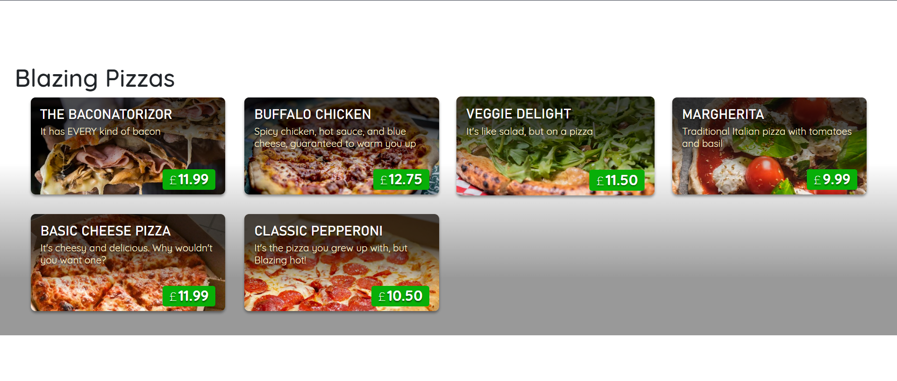

# Create a user interface with Blazor components

- Run the following to create a new Blazor App:

```
dotnet new blazorserver -o BlazingPizza --no-https true -f net6.0
```

- Start the Blazor App:

```
dotnet watch
```

# Pizza Page


# Access data from a Blazor component
Engaging websites need to display dynamic content that might change all the time. Obtaining data from a dynamic source, such as a database or web service, is a fundamental technique in web development.

# Creating a registered data service
- Create a data class
- Create a service class

[Learn more here](https://learn.microsoft.com/en-us/training/modules/interact-with-data-blazor-web-apps/4-access-data-from-blazor-components)


# Share data in Blazor applications
Blazor includes several ways to share information between components. You can use component parameters or cascading parameters to send values from a parent component to a child component. The AppState pattern is another approach you can use to store values and access them from any component in the application.

[Learn how to share data between blazor components](https://learn.microsoft.com/en-us/training/modules/interact-with-data-blazor-web-apps/6-share-data-in-blazor-applications)

